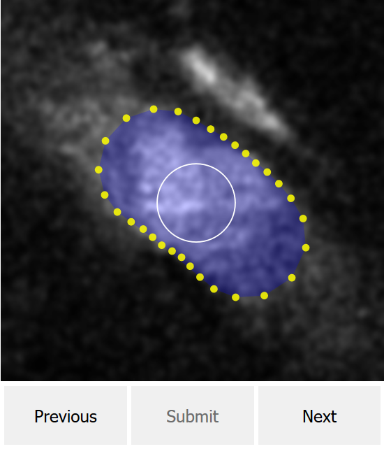

# Blood vessel annotation tool

Manual outlining of vascular cross-sections using a web browser.
The annotation task consists of adjusting a polygonal shape with a fixed number of vertices on the top of the vessel. The user can inspect the time evolution of the vessel and their annotations by freely scrolling through the time-lapse images.

This is a *standalone version* of the annotation toolbox that allows you to load images, complete the task, and download the results to your computer. An alternative version of this annotation toolbox (not available here) runs on a web server and allows an arbitrary number of annotators to simultaneously complete these tasks directly in the cloud where tasks are automatically and centrally served and stored.

For the study "[Astrocytes amplify neurovascular coupling to sustained activation of neocortex in awake mice][paper search]", the annotation tool was deployed in [Amazon Web Services][AWS] and the tasks (consisting of outlining over 25000 images) were completed by crowdsourcing help from participants from [Amazon Mechanical Turk][AMT].

## Prerequisites
* [Firefox](https://www.mozilla.org/firefox/download) or [Chrome](https://www.google.com/chrome).

## Installation
* Download and extract [repository][repository].
* Extract [`test-data.zip`](standalone/test-data.zip).

## Usage
* If running locally, open `annotation.html` with a web browser, otherwise, go to the [standalone demo].
* Follow the annotation instructions.
* When finished, click on `Submit` to download the results.

## Demo
* [Standalone demo][standalone demo]
* Video [demo 1][instructions video] and [demo 2][reviewer video]

## Output
The results are downloaded to your computer in JSON format where each line corresponds to an image. The following fields are saved:
* `folder`: name of the selected folder.
* `name`: name of the image completed within folder.
* `area`: area calculated inside the polygon drawn.
* `vertices`: `x` and `y` coordinates of each point in the drawing.
* `polygon`: `x` and `y` coordinates of each point of the concavehall around the vertices.
* `height`: height of the image presented to the user
* `assignmentId`/`hitId`/`workerId`: variables used in the server version of the toolbox to identify assignment, task, and annotator, respectively.
* `start`: when task started.
* `end`: when task ended.

## Software license
© 2018 [Leonardo Molina][Leonardo Molina]

[Leonardo Molina]: https://github.com/leomol

[AWS]: https://aws.amazon.com
[AMT]: https://www.mturk.com
[preprint]: https://doi.org/10.1101/2020.12.16.422785
[paper search]: https://duckduckgo.com/?q=!ducky+Astrocytes+amplify+neurovascular+coupling+to+sustained+activation+of+neocortex+in+awake+mice
[repository]: https://github.com/leomol/vessel-annotation/archive/refs/heads/master.zip
[instructions video]: https://www.youtube.com/watch?v=Fw_KW6LHATU
[reviewer video]: https://www.youtube.com/watch?v=pHEZycdW2ng
[standalone demo]: https://codepen.io/leonardomt/full/jOEvPvY
[LICENSE.md]: LICENSE.md